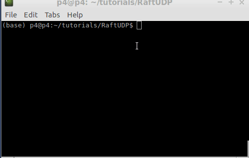
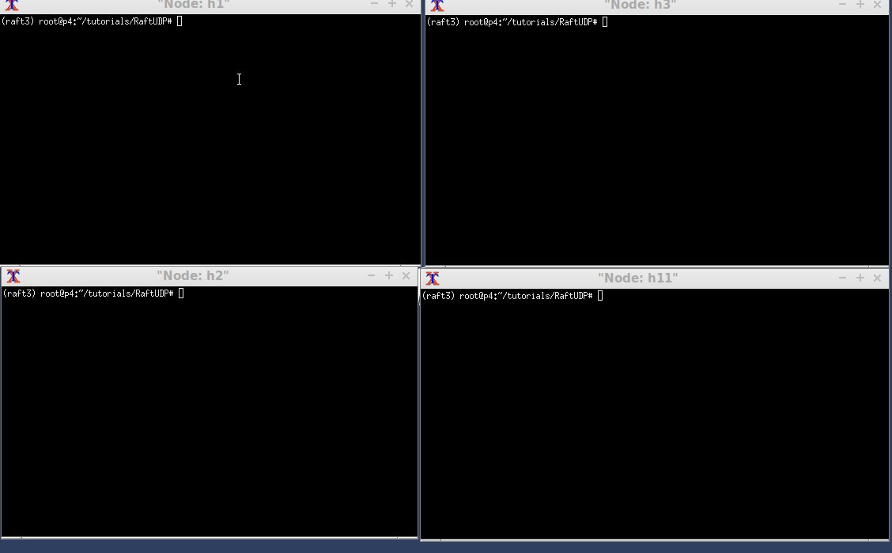

# Introduction
RaftUDP is an implementation of Raft's Consensus algorithm that
uses UDP segments, crafted using Scapy 2.4.2 (see references).
This implementation provides the following features:
* leader election
* log replication
* node recovering after failures either of a leader node or a non-leader node (contemporary failures must not exceed the majority of nodes, as explained in Raft)
# Getting started
download and run the VM of [P4lang](https://www.github.com/p4lang/tutorials) (it's the fastest way to get a working environment).

This project relies on [Mininet](http://mininet.org), using P4's BMV2 switches.
The topology is described in **topology.png**


When ready, navigate to the cloned/downloaded folder of this project, open a shell and run:
```
make run
```
at this point, you should see the Mininet shell.

## running the application
inside mininet prompt, run 
```
xterm h1 h2 h3 h11
```
to open the emulated hosts' terminal.



on h1 terminal type
```
python raft_server.py 0
```
The '0' is intended as the index of the list defined in **raft_definitions.py -> NODES_IPS**.
For example, with '0' we are letting the application know that our node has the first IP denoted inside NODES_IPS (in my case **10.0.1.1**).

on h2 terminal type:
```
python raft_server.py 1
```
on h3 terminal type:
```
python raft_server.py 2
```

if you want to run on all the nodes present in the topology, just edit the NODES_IPS list and run with the method described above.

## Value Consensus
open a shell on a free node (it must not be in execution of the raft application), for example node 11 (**h11** defined in **topology.png**):
```
python raft_client.py -s 10.0.1.11 -d 10.0.1.1 -da 1
```
parameters explanation:
* -s: source ip of the client (node 11's IP, in our case).
* -d: destination IP (it should be the leader's IP. if you point to a node that it's not a leader,
 it will return 'false' in a RAW UDP segment).
* -da: this is the actual value that will be inserted inside the log.


# Improvements
* The code could be modified in such a way to use a single udp port for voting/heartbeats, exploiting the messageType,
instead of using two ports.
* implement a redirect logic when a client sends a new request to a non-leader node.
* Could be implemented using QUIC instead of UDP.
* implement an encoding-decoding structure to support also strings and other types.
* handle fragmentation to support an higher data exchange 
(actually it only support values that are
lower than the maximum that UDP can handle in one segment).

# Troubleshooting
* if you have errors by running the application, most probably you have to check inside the makefile
and fix the path of BMV2 and P4C
* If mininet shows an error like **Error creating interface pair: RTNETLINK answers: File exists** on start, try 'make stop' and then again 'make run'

# Known Issues
* sometimes an exception in the new_request section inside **raft_server.py** occurs.
I'm still investigating the causes

# Warnings
* 0 (0x0) value is not supported (yes, this is quite an annoying limitation, I will try to find a workaround)
* not tested outside mininet
* playing with timings defined in **raft_definitions.py** it's generally a bad idea. Everything works because of that timings.
* <u>this version is not intended to be used in production</u>

* **With Python2.7 only the leader election works, not the log replication, maybe due to thread concurrency.**
* If you use Python2.7, quit the application with CTRL+/. CTRL+C didn't work for me.

# References
[Raft](https://raft.github.io/) <br>
[Scapy](https://scapy.net/) <br>
[P4](https://p4.org) <br>
inspired by [Vesper](https://github.com/Oaklight/Vesper)
